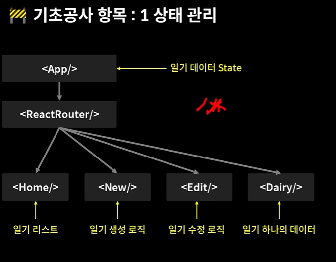

#EMOTION_DIARY.

<h2>🍊 다이어리 만들기 프로젝트</h2>

<h3>📁REACT ROUNTER V6</h3>

 리엑트에서 CSR 기반의 페이지 라우팅을 할 수 있게 해주는 라이브러리

 기능1. PathVariable  :: useParams 

 기능2. Query String :: useSearchParams 

 기능3. Page Moving :: useNavigate 

<h3>📁 기초공사 </h3>

1. 폰트세팅

Google web Fonts를 이용한 프로젝트에서 사용되는 폰트 세팅

2. 레이아웃 세팅

모든 페이지에 반영되는 레이아웃 세팅

3. 이미지 에셋 세팅

감정 이미지들을 프로젝트에서 불러와 사용할 수 있는 환경 세팅

4. 공통 컴포넌트 세팅

모든 페이지에 공통으로 사용되는 버튼, 헤더 컴포넌트 세팅

5. 상태 관리 세팅하기

프로젝트 전반적으로 사용될 일기 데이터 state 관리 로직 작성하기

6. 프로젝트 State Context 세팅하기

일기 데이터 State를 공급할 Context를 생성하고 Provider로 공급하기

7. 프로젝트 Dispatch Context 세팅하기

일기 데이터 State 의 Dispatch 함수들을 공급할 Context를 생성하고 Provider 로 공급하기

